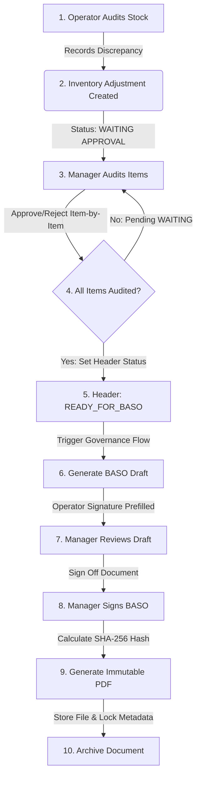
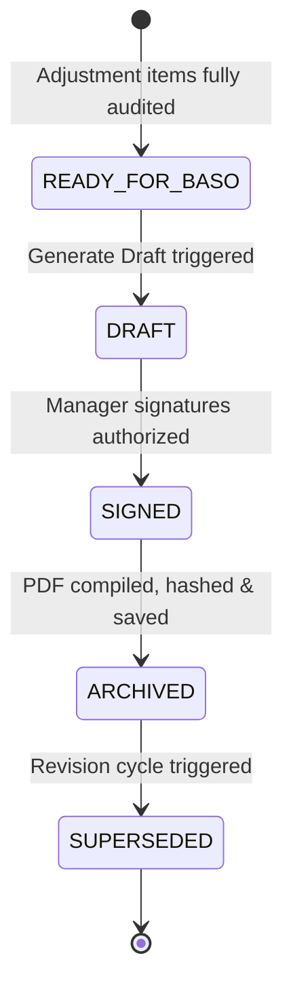
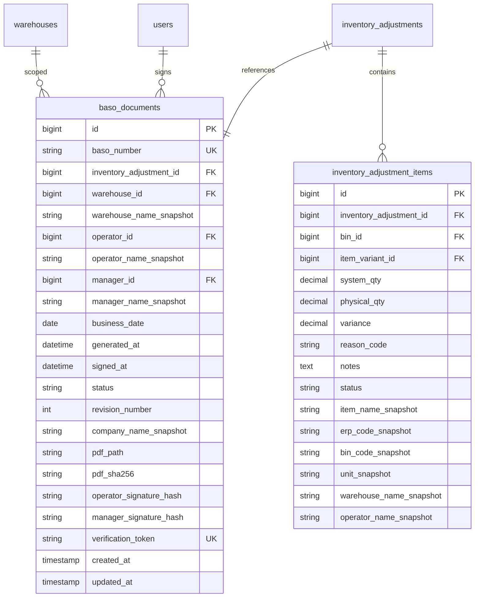
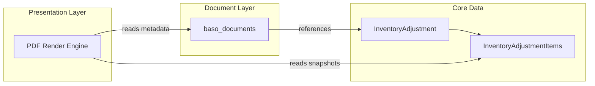

# ADR-002: Berita Acara Stock Opname (BASO) Design Document

## Status
Accepted

## Date
2026-06-30

---

## 1. Business Workflow

The Berita Acara Stock Opname (BASO) acts as the official legal and operational document certifying physical inventory audits and their subsequent adjustments in the system ledger. To support flexible operations, the creation of a BASO is decoupled from the completion of the `InventoryAdjustment`. The workflow is designed as follows:



1. **Physical Audit Entry**: The operator scans items and submits discrepancies, creating an `InventoryAdjustment` header and child items.
2. **Item-Level Auditing**: The manager reviews and approves/rejects each adjustment item.
3. **Transition to Readiness**: Once all items under a header are approved or rejected, the `InventoryAdjustment` header status transitions to `READY_FOR_BASO`. 
4. **Draft Generation**: When governance compilation is initiated, a draft BASO document is created in the database. The operator's digital signature hash is automatically pre-filled since the operator initiated the source data.
5. **Manager Review & Sign**: The manager reviews the compiled metadata and signs off.
6. **PDF Archival**: Upon signature, the system compiles the final PDF, calculates its `SHA-256` integrity hash, writes the file to static storage, and marks the document state as `ARCHIVED`.

---

## 2. Document Lifecycle

The BASO transitions through the following state machine:



- **`READY_FOR_BASO`**: Sourced from a completed `InventoryAdjustment` header, awaiting document compilation.
- **`DRAFT`**: BASO record generated in database. The document details are reviewable, but the manager signature block remains empty.
- **`SIGNED`**: The manager authorizes the document, locking system attributes and generating authorization hashes.
- **`ARCHIVED`**: Static A4 PDF generated, SHA-256 verified, saved, and linked via `pdf_path`.
- **`SUPERSEDED`**: The document has been invalidated by a subsequent correction/revision cycle.

---

## 3. Entity Relationship & Dependency Diagram

To prevent duplication and data sync risks, the dedicated `baso_items` table is eliminated. Instead, the BASO document reads the immutable snapshots directly from the source `inventory_adjustment_items`.



### Dependency Flow



---

## 4. Database Design (Metadata Schema)

The `baso_documents` table is defined as follows:

| Column Name | SQL Type | Constraints | Description |
| :--- | :--- | :--- | :--- |
| `id` | BIGINT | PRIMARY KEY, AUTO_INCREMENT | Unique identifier. |
| `baso_number` | VARCHAR(50) | UNIQUE, NOT NULL | Format: `BASO-SPAREPART-YYYYMMDD-SEQ`. |
| `inventory_adjustment_id` | BIGINT | FOREIGN KEY, NOT NULL | References `inventory_adjustments(id)`. |
| `warehouse_id` | BIGINT | FOREIGN KEY, NOT NULL | References `warehouses(id)`. |
| `warehouse_name_snapshot` | VARCHAR(255) | NOT NULL | Snapshotted warehouse name. |
| `operator_id` | BIGINT | FOREIGN KEY, NOT NULL | References `users(id)` (Operator). |
| `operator_name_snapshot` | VARCHAR(255) | NOT NULL | Snapshotted operator name. |
| `manager_id` | BIGINT | FOREIGN KEY, NULLABLE | References `users(id)` (Manager PPIC). |
| `manager_name_snapshot` | VARCHAR(255) | NULLABLE | Snapshotted manager name at sign-off. |
| `business_date` | DATE | NOT NULL | Date the physical audit was conducted. |
| `generated_at` | DATETIME | NOT NULL | Timestamp when draft was initialized. |
| `signed_at` | DATETIME | NULLABLE | Timestamp when manager signed off. |
| `status` | VARCHAR(30) | NOT NULL | `DRAFT`, `SIGNED`, `ARCHIVED`, `SUPERSEDED`. |
| `revision_number` | INT | NOT NULL, DEFAULT 0 | Revision counter for the document. |
| `company_name_snapshot` | VARCHAR(255) | NOT NULL | Snapshotted legal company name. |
| `pdf_path` | VARCHAR(255) | NULLABLE | File path to the archived static PDF. |
| `pdf_sha256` | VARCHAR(64) | NULLABLE | SHA-256 hash of the generated PDF file. |
| `operator_signature_hash` | VARCHAR(64) | NOT NULL | Cryptographic signature of the operator. |
| `manager_signature_hash` | VARCHAR(64) | NULLABLE | Cryptographic signature of the manager. |
| `verification_token` | VARCHAR(36) | UNIQUE, NOT NULL | UUID/Token for QR code lookup mapping. |
| `created_at` | TIMESTAMP | NULLABLE | Eloquent timestamp. |
| `updated_at` | TIMESTAMP | NULLABLE | Eloquent timestamp. |

---

## 5. Signature Strategy & Verification Display

### Signature Hashing
- **Operator Hash**: Hashed representation of `operator_id` + `operator_name_snapshot` + `generated_at` + `verification_token` + `company_name_snapshot` using a server cryptographic secret.
- **Manager Hash**: Calculated only when manager signs. Hashed representation of `manager_id` + `manager_name_snapshot` + `signed_at` + `operator_signature_hash` using the server cryptographic secret.

### PDF Presentation
To keep the layout clean while preserving integrity, the PDF will not render the full SHA-256 strings. It will display a short Verification ID (first 8 characters of the respective signature hash) alongside verified indicators:

```text
------------------------------------------------------------------
SIGNATURES
------------------------------------------------------------------
Operator:                          Manager PPIC:
[Name Snapshot]                    [Name Snapshot]
Date: 2026-06-30                   Date: 2026-06-30
Verification ID: [op_sig_hash_8]   Verification ID: [mn_sig_hash_8]
Status: Verified (WMS)             Status: Verified (WMS)
------------------------------------------------------------------
```

---

## 6. PDF Layout & A4 Wireframe

To comply with ISO 9001:2015 audit standards, every page of the generated PDF must render repeating header information, footers (with page numbers, generation timestamps, and verification QR codes), and a small signature verification area at the bottom.

### A4 Wireframe Layout

```text
+-----------------------------------------------------------------------------+
|                                                                             |
|  PT PERONIKS INDONESIA                                                      |
|  BERITA ACARA STOCK OPNAME                                                  |
|  Nomor BASO: BASO-SPAREPART-20260630-001                                    |
|  -------------------------------------------------------------------------  |
|  Warehouse: Gudang Sparepart Cikarang         Tanggal: 2026-06-30           |
|  Operator : Afini Fathur                      Manager: Manager PPIC         |
|  -------------------------------------------------------------------------  |
|                                                                             |
|  ITEMS TABLE                                                                |
|  +----------+----------------------+---------+------------+----------+---+  |
|  | ERP Code | Item Name            | Bin     | System Qty | Phys Qty |Var|  |
|  +----------+----------------------+---------+------------+----------+---+  |
|  | 607.ZZ   | BEARING EZO 607 ZZ   | A-01-04 | 12         | 13       |+1 |  |
|  | 608.2RS  | BEARING 608 2RS      | A-01-05 | 20         | 18       |-2 |  |
|  +----------+----------------------+---------+------------+----------+---+  |
|                                                                             |
|  -------------------------------------------------------------------------  |
|  SUMMARY                                                                    |
|  Total Items: 2 | Approved: 1 | Rejected: 1 | Variance: -1                  |
|  -------------------------------------------------------------------------  |
|                                                                             |
|  SIGNATURES                                                                 |
|  Operator:                               Manager PPIC:                      |
|  Afini Fathur                            Manager PPIC                       |
|  Date: 2026-06-30                        Date: 2026-06-30                   |
|  Verification ID: a8f9c2d1               Verification ID: b1c4d9e2          |
|  Status: Verified (WMS)                  Status: Verified (WMS)             |
|                                                                             |
|  -------------------------------------------------------------------------  |
|  [Page Sign-off Verification: OK | Initials: ______ ]                       |
|  -------------------------------------------------------------------------  |
|  Page 1 of 1           Generated At: 2026-06-30 16:27     [ QR Code Token ] |
+-----------------------------------------------------------------------------+
```

---

## 7. PDF Strategy & Storage Integrity

### Print Engine
- **Browsershot (Puppeteer)** is the chosen library. It compiles HTML with native layout accuracy, supports full CSS Grid/Flexbox, repeating table headers, page-break margins, and renders verification QR codes inline.
- **DomPDF** remains the standby fallback for systems where Chromium installation is prohibited.

### Storage & Integrity (`pdf_sha256`)
1. Once the PDF is rendered, the system reads the binary file stream.
2. The system computes a `SHA-256` checksum of this file.
3. This hash is saved in `baso_documents.pdf_sha256`.
4. During audits, the system can recalculate the hash of the stored PDF. If the recalculated hash matches the stored hash, the document's integrity is verified.

---

## 8. QR Code Strategy (Verification Token)

To maintain link stability across domain migrations:
- The printed QR code will encode a plain verification token/UUID (e.g. `c0e86b24-2cbf-4e08-9df2-bb53f4c6e9d8`).
- The mobile verification scanning app or a public redirection handler will parse this token and query the WMS server endpoint: `/verify/baso/{verification_token}`.
- This ensures that if the server moves from `wms.peroniks.com` to `wms.peroniks.co.id`, historical QR codes remain resolvable by pointing the mobile app wrapper or proxy server to the updated domain.

---

## 9. Sidebar Structure

The sidebar under the **GOV (Governance)** segment is updated:

```text
GOV (Governance)
├── Stock Opname           (Physical entry - Operator)
├── Inventory Adjustment   (Approval queue - Manager)
└── Berita Acara (BASO)    (Official sign-off & archives)
```

---

## 10. BASO Statistics (Index KPIs)

The BASO index page will render statistical metrics to evaluate governance throughput:

- **`Today BASO`**: Total BASO documents generated today.
- **`This Week`**: Total BASO documents compiled this week.
- **`This Month`**: Total BASO documents compiled this month.
- **`Average Approval Time`**: Mean duration from `READY_FOR_BASO` status to signed and archived state.
- **`Rejected Documents`**: Total BASO documents containing one or more rejected items (providing visibility into operator inventory count accuracy).
- **`Average Items per BASO`**: Mean quantity of items listed in a BASO batch.

---

## 11. Revision Strategy

BASO documents are immutable once signed. If modifications are required:
1. The status of the original BASO is updated to `SUPERSEDED`.
2. A new BASO record is generated with the same base reference but `revision_number` incremented by 1 (e.g. `BASO-SPAREPART-20260630-001-R1`).
3. The new PDF is compiled, hashed, and archived.
4. The system links the superseded document to the new version in the user interface to ensure a transparent audit trail.

---

## 12. Future Phase Roadmap

The revised roadmap is structured into 8 distinct phases:

```mermaid
gantt
    title Revised BASO Project Timeline
    dateFormat  YYYY-MM-DD
    section Phase D
    D1: Architecture Design (DONE)   :active, d1, 2026-06-30, 1d
    D2: Metadata Migration & Header : d2, after d1, 2d
    D3: PDF Blade Template          : d3, after d2, 2d
    D4: Signature Hashing Flow      : d4, after d3, 1d
    D5: Archive Queue & PDF Storage : d5, after d4, 2d
    D6: Verification Public Route   : d6, after d5, 1d
    D7: Statistics Dashboard UI     : d7, after d6, 2d
    D8: End-to-End Validation       : d8, after d7, 1d
```

- **Phase D1 (Architecture)**: Document architectural decisions and establish baseline metadata schemas.
- **Phase D2 (Metadata Migration & Header)**: Create migration for `baso_documents`, build the Eloquent model, and establish relations.
- **Phase D3 (PDF Blade)**: Develop the CSS and Blade view for A4 print templates.
- **Phase D4 (Signature)**: Implement digital cryptographic signing logic for operators and managers.
- **Phase D5 (Archive)**: Configure the storage filesystem and job queues to compile and write static PDF files to disk.
- **Phase D6 (Verification)**: Build public endpoints and UI for token lookup and document validation.
- **Phase D7 (Statistics)**: Construct the Livewire dashboard for BASO metrics.
- **Phase D8 (End-to-End Validation)**: Perform integration tests from physical count submission to signed PDF archival.
